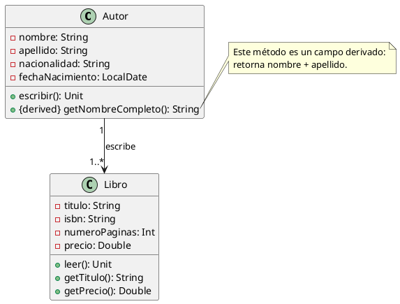

# **SOLUCION:  Ejercicio 5 - Sistema de Libros y Autores**

## **Objetivo**

Diseñar el **diagrama de clases UML** para un sistema simple de gestión de libros y autores, respetando encapsulación, cardinalidades y campos derivados.

---

# **1. Identificación de clases**

### Clases detectadas:

* **Autor**
* **Libro**

---

# **2. Atributos y Métodos**

## **Clase Autor**

### ▸ Atributos privados

* `-nombre: String`
* `-apellido: String`
* `-nacionalidad: String`
* `-fechaNacimiento: LocalDate`

### ▸ Métodos públicos

* `+escribir(): Unit`
* `+getNombreCompleto(): String` *(campo derivado: nombre + apellido)*

---

## **Clase Libro**

### ▸ Atributos privados

* `-titulo: String`
* `-isbn: String`
* `-numeroPaginas: Int`
* `-precio: Double`

### ▸ Métodos públicos

* `+leer(): Unit`
* `+getTitulo(): String`
* `+getPrecio(): Double`

---

# **3. Relaciones**

### Un Autor **escribe** uno o varios Libros

### Un Libro **es escrito por** un único Autor

Cardinalidades:

* **Autor → Libro : 1..***
* **Libro → Autor : 1**

Rol:

* Desde **Autor** → **Libro**: *escribe*

---

# **4. Notas UML**

* `getNombreCompleto()` es un **campo derivado**, por tanto se marca como:
  `{derived}`
* Se puede añadir una **nota UML (note)** explicando qué significa.

---

# **5. Diagrama UML (PlantUML)**

Puedes pegarlo directamente en PlantUML:



---

# **6. Código Kotlin**

*(Solo clases, atributos y métodos vacíos)*

```kotlin
import java.time.LocalDate

class Autor(
    private var nombre: String,
    private var apellido: String,
    private var nacionalidad: String,
    private var fechaNacimiento: LocalDate
) {

    fun escribir() {}

    fun getNombreCompleto(): String {}
}

class Libro(
    private var titulo: String,
    private var isbn: String,
    private var numeroPaginas: Int,
    private var precio: Double,
    private var autor: Autor  // relación 1 Autor por Libro
) {

    fun leer() {}

    fun getTitulo(): String {}

    fun getPrecio(): Double {}
}
```