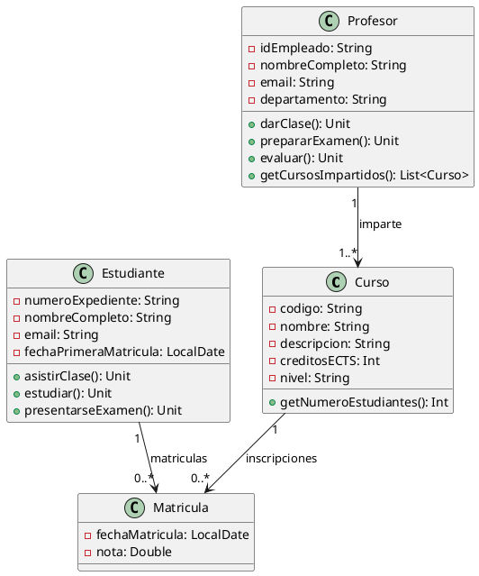

# **Solucion: Ejercicio 2 - Sistema de Gestión de Cursos Universitarios**

## Objetivo

Modelar un sistema universitario con cursos, profesores, estudiantes y matrículas (como clase de asociación).

---

# 1. Identificación de clases

A partir de las reuniones:

### Clases principales:

* **Curso**
* **Profesor**
* **Estudiante**
* **Matricula** (clase de asociación)

---

# 2. Atributos y métodos

## **Clase Curso**

### Atributos privados

* `-codigo: String`
* `-nombre: String`
* `-descripcion: String`
* `-creditosECTS: Int`
* `-nivel: String`  *(grado, máster, doctorado)*

### Métodos públicos

* `+getNumeroEstudiantes(): Int`

---

## **Clase Profesor**

### Atributos privados

* `-idEmpleado: String`
* `-nombreCompleto: String`
* `-email: String`
* `-departamento: String`

### Métodos públicos

* `+darClase(): Unit`
* `+prepararExamen(): Unit`
* `+evaluar(): Unit`
* `+getCursosImpartidos(): List<Curso>`

---

## **Clase Estudiante**

### Atributos privados

* `-numeroExpediente: String`
* `-nombreCompleto: String`
* `-email: String`
* `-fechaPrimeraMatricula: LocalDate`

### Métodos públicos

* `+asistirClase(): Unit`
* `+estudiar(): Unit`
* `+presentarseExamen(): Unit`

---

## **Clase Matricula (clase de asociación)**

### Atributos privados

* `-fechaMatricula: LocalDate`
* `-nota: Double?` *(puede ser null porque al principio no existe nota)*

### Métodos públicos

* Ninguno obligatorio (es una entidad de datos)

---

# 3. Relaciones UML

### Profesor — Curso

* Un **Profesor imparte 1..*** cursos
* Un **Curso es impartido por 1** profesor
* Rol desde profesor: *imparte*

### Estudiante — Curso → **Muchos a muchos**

Pero como tiene atributos (fecha, nota), se modela con:

### Clase de Asociación: Matricula

Relaciones:

* Estudiante "1" → "0..*" Matricula
* Curso "1" → "0..*" Matricula

Rol desde Estudiante: *matriculas*
Rol desde Curso: *inscripciones*

---

# 4. Diagrama UML en PlantUML



---

# 5. Código Kotlin

```kotlin
import java.time.LocalDate

class Curso(
    private var codigo: String,
    private var nombre: String,
    private var descripcion: String,
    private var creditosECTS: Int,
    private var nivel: String,
    private var profesor: Profesor
) {

    fun getNumeroEstudiantes(): Int {}
}

class Profesor(
    private var idEmpleado: String,
    private var nombreCompleto: String,
    private var email: String,
    private var departamento: String
) {

    fun darClase() {}

    fun prepararExamen() {}

    fun evaluar() {}

    fun getCursosImpartidos(): List<Curso> {}
}

class Estudiante(
    private var numeroExpediente: String,
    private var nombreCompleto: String,
    private var email: String,
    private var fechaPrimeraMatricula: LocalDate
) {

    fun asistirClase() {}

    fun estudiar() {}

    fun presentarseExamen() {}
}

class Matricula(
    private var fechaMatricula: LocalDate,
    private var nota: Double?,
    private var estudiante: Estudiante,
    private var curso: Curso
)
```
