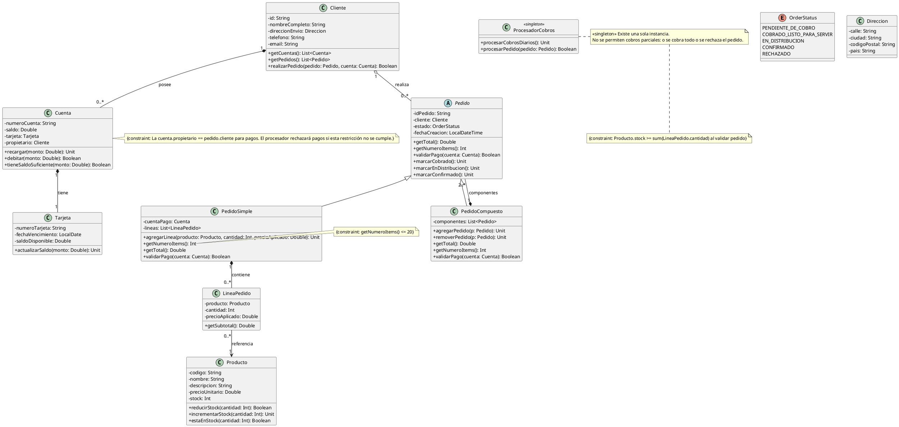

# **Solución: Ejercicio 3 - Sistema de Gestión de Pedidos E-Commerce**

## Objetivo

Modelar un sistema de gestión de pedidos para un e-commerce que incluya clientes, cuentas y tarjetas, productos con control de stock, pedidos simples y compuestos (patrón Composite), líneas de pedido como clase de asociación, procesador de cobros como Singleton y restricciones de negocio.

---

# 1. Identificación de clases

A partir de las reuniones:

### Clases principales:

* **Cliente**
* **Direccion** (valor/objeto)
* **Cuenta**
* **Tarjeta**
* **Producto**
* **Pedido** (abstracta — componente del Composite)
* **PedidoSimple** (hoja)
* **PedidoCompuesto** (composite)
* **LineaPedido** (clase de asociación entre Pedido y Producto)
* **ProcesadorCobros** (Singleton)
* **OrderStatus** (enumeración)

---

# 2. Atributos y métodos

> Visibilidad: atributos con `-` (privado), métodos con `+` (público). Se incluyen tipos sugeridos (Kotlin/Java-like).

---

## **Clase Cliente**

### Atributos privados

* `-id: String`
* `-nombreCompleto: String`
* `-direccionEnvio: Direccion`
* `-telefono: String`
* `-email: String`

### Métodos públicos

* `+getCuentas(): List<Cuenta>`
* `+getPedidos(): List<Pedido>`
* `+realizarPedido(pedido: Pedido, cuenta: Cuenta): Boolean`  *(valida pertenencia de cuenta, stock y registra pedido)*

---

## **Clase Direccion** (objeto valor)

### Atributos privados

* `-calle: String`
* `-ciudad: String`
* `-codigoPostal: String`
* `-pais: String`

### Métodos públicos

* Ninguno obligatorio (es un value object)

---

## **Clase Cuenta**

### Atributos privados

* `-numeroCuenta: String`
* `-saldo: Double`
* `-tarjeta: Tarjeta`
* `-propietario: Cliente`

### Métodos públicos

* `+recargar(monto: Double): Unit`
* `+debitar(monto: Double): Boolean`  *(false si saldo insuficiente)*
* `+tieneSaldoSuficiente(monto: Double): Boolean`

---

## **Clase Tarjeta**

### Atributos privados

* `-numeroTarjeta: String`
* `-fechaVencimiento: LocalDate`
* `-saldoDisponible: Double`  *(puede diferir del saldo de la cuenta)*

### Métodos públicos

* `+actualizarSaldo(monto: Double): Unit`

---

## **Clase Producto**

### Atributos privados

* `-codigo: String`
* `-nombre: String`
* `-descripcion: String`
* `-precioUnitario: Double`
* `-stock: Int`

### Métodos públicos

* `+reducirStock(cantidad: Int): Boolean`
* `+incrementarStock(cantidad: Int): Unit`
* `+estaEnStock(cantidad: Int): Boolean`

---

## **Clase Pedido (abstracta — componente del Composite)**

### Atributos protegidos / privados

* `-idPedido: String`
* `-cliente: Cliente`
* `-estado: OrderStatus`
* `-fechaCreacion: LocalDateTime`

### Métodos públicos / abstractos

* `+getTotal(): Double`  *(campo derivado — suma de líneas o suma recursiva)*
* `+getNumeroItems(): Int`  *(campo derivado)*
* `+validarPago(cuenta: Cuenta): Boolean`
* `+marcarCobrado(): Unit`
* `+marcarEnDistribucion(): Unit`
* `+marcarConfirmado(): Unit`

---

## **Clase PedidoSimple (extiende Pedido — hoja)**

### Atributos privados

* `-cuentaPago: Cuenta`  *(la cuenta usada para pagar este pedido simple)*
* `-lineas: List<LineaPedido>`  *(composición — las líneas pertenecen al pedido simple)*

### Métodos públicos

* `+agregarLinea(producto: Producto, cantidad: Int, precioAplicado: Double): Unit`
* `+getNumeroItems(): Int`  *(suma de cantidades de las líneas)*
* `+getTotal(): Double`  *(suma de subtotales)*
* `+validarPago(cuenta: Cuenta): Boolean`

### Restricciones (constraints)

* `{constraint: getNumeroItems() <= 20}`

---

## **Clase PedidoCompuesto (extiende Pedido — composite)**

### Atributos privados

* `-componentes: List<Pedido>`  *(composición — contiene pedidos)*

### Métodos públicos

* `+agregarPedido(p: Pedido): Unit`
* `+removerPedido(p: Pedido): Unit`
* `+getTotal(): Double`  *(suma recursiva de componentes)*
* `+getNumeroItems(): Int`  *(suma recursiva)*
* `+validarPago(cuenta: Cuenta): Boolean`  *(política: depende de reglas — ver notas)*

### Restricciones (constraints)

* `{constraint: componentes.size() >= 2}`

**Nota:** Un `PedidoCompuesto` puede contener `PedidoSimple` y/o otros `PedidoCompuesto` (recursividad).

---

## **Clase LineaPedido (clase de asociación entre Pedido y Producto)**

### Atributos privados

* `-producto: Producto`
* `-cantidad: Int`
* `-precioAplicado: Double`  *(precio unitario en el momento del pedido — inmutable respecto a cambios en Producto)*

### Métodos públicos

* `+getSubtotal(): Double`  *(cantidad * precioAplicado)*

**Relaciones:** `LineaPedido` se asocia a un `Pedido` (pertenece) y referencia un `Producto`.

---

## **Clase ProcesadorCobros (Singleton)**

### Estereotipo

* `<<singleton>>`  *(única instancia en todo el sistema)*

### Métodos públicos

* `+procesarCobrosDiarios(): Unit`  *(recorre pedidos con estado PENDIENTE_DE_COBRO y procesa)*
* `+procesarPedido(pedido: Pedido): Boolean`  *(intenta cobrar; si falla rechazo total; devuelve true si cobrado)*

### Reglas asociadas

* No se permiten cobros parciales: o se cobra todo o se rechaza.
* `{constraint: cuenta.propietario == pedido.cliente}` — la cuenta usada debe pertenecer al cliente que realiza el pedido.

---

## **Enumeración OrderStatus**

### Valores

* `PENDIENTE_DE_COBRO`
* `COBRADO_LISTO_PARA_SERVIR`
* `EN_DISTRIBUCION`
* `CONFIRMADO`
* `RECHAZADO`

---

# 3. Relaciones UML (roles y cardinalidades)

* **Cliente — Cuenta**: Cliente `1` *-- `0..*` Cuenta (composición/posee). Rol desde Cliente: *posee*
* **Cuenta — Tarjeta**: Cuenta `1` *-- `1` Tarjeta (composición). Rol: *tiene*
* **Cliente — Pedido**: Cliente `1` o-- `0..*` Pedido (agregación). Rol: *realiza*
* **Pedido** (abstracta) — **PedidoSimple / PedidoCompuesto**: Generalización (`Pedido` <|-- `PedidoSimple`, `PedidoCompuesto`)
* **PedidoSimple — LineaPedido**: PedidoSimple `1` *-- `0..*` LineaPedido (composición). Rol: *contiene*
* **LineaPedido — Producto**: LineaPedido `0..*` --> `1` Producto (asociación, referencia). Rol: *referencia*
* **PedidoCompuesto — Pedido**: PedidoCompuesto `1` *-- `2..*` Pedido : *componentes* (composición recursiva)
* **ProcesadorCobros**: Estereotipado `<<singleton>>` y no tiene multiplicidad (única instancia)

**Constraints clave (resumidas):**

* `PedidoSimple::getNumeroItems() <= 20`
* `Cuenta::propietario == Pedido::cliente` para pagos — `{constraint}`
* `PedidoCompuesto::componentes.size() >= 2`
* `Producto.stock >= suma(cantidades de LineaPedido)` al validar creación del pedido
* Cobros: no parciales — si `cuenta.saldo < pedido.total` => rechazo total

---

# 4. Diagrama UML en PlantUML



---

# 5. Código Kotlin

> Traducción directa del diagrama a Kotlin: **solo clases, atributos y firmas de métodos** (sin implementar la lógica interna). Sigo el estilo del ejemplo que pediste (métodos vacíos).

```kotlin
import java.time.LocalDate
import java.time.LocalDateTime

enum class OrderStatus {
    PENDIENTE_DE_COBRO,
    COBRADO_LISTO_PARA_SERVIR,
    EN_DISTRIBUCION,
    CONFIRMADO,
    RECHAZADO
}

/* Direccion (value object) */
class Direccion(
    private var calle: String,
    private var ciudad: String,
    private var codigoPostal: String,
    private var pais: String
)

/* Cliente */
class Cliente(
    private var id: String,
    private var nombreCompleto: String,
    private var direccionEnvio: Direccion,
    private var telefono: String,
    private var email: String
) {
    fun getCuentas(): List<Cuenta> {}
    fun getPedidos(): List<Pedido> {}
    fun realizarPedido(pedido: Pedido, cuenta: Cuenta): Boolean {}
}

/* Cuenta */
class Cuenta(
    private var numeroCuenta: String,
    private var saldo: Double,
    private var tarjeta: Tarjeta,
    private var propietario: Cliente
) {
    fun recargar(monto: Double) {}
    fun debitar(monto: Double): Boolean {}
    fun tieneSaldoSuficiente(monto: Double): Boolean {}
}

/* Tarjeta */
class Tarjeta(
    private var numeroTarjeta: String,
    private var fechaVencimiento: LocalDate,
    private var saldoDisponible: Double
) {
    fun actualizarSaldo(monto: Double) {}
}

/* Producto */
class Producto(
    private var codigo: String,
    private var nombre: String,
    private var descripcion: String,
    private var precioUnitario: Double,
    private var stock: Int
) {
    fun reducirStock(cantidad: Int): Boolean {}
    fun incrementarStock(cantidad: Int) {}
    fun estaEnStock(cantidad: Int): Boolean {}
}

/* LineaPedido (clase de asociación) */
class LineaPedido(
    private var producto: Producto,
    private var cantidad: Int,
    private var precioAplicado: Double
) {
    fun getSubtotal(): Double {}
}

/* Pedido (abstracta) */
abstract class Pedido(
    protected var idPedido: String,
    protected var cliente: Cliente,
    protected var estado: OrderStatus,
    protected var fechaCreacion: LocalDateTime
) {
    abstract fun getTotal(): Double
    abstract fun getNumeroItems(): Int
    abstract fun validarPago(cuenta: Cuenta): Boolean
    fun marcarCobrado() {}
    fun marcarEnDistribucion() {}
    fun marcarConfirmado() {}
}

/* PedidoSimple (hoja) */
class PedidoSimple(
    idPedido: String,
    cliente: Cliente,
    private var cuentaPago: Cuenta
) : Pedido(idPedido, cliente, OrderStatus.PENDIENTE_DE_COBRO, LocalDateTime.now()) {

    private var lineas: MutableList<LineaPedido> = mutableListOf()

    fun agregarLinea(producto: Producto, cantidad: Int, precioAplicado: Double) {}
    override fun getNumeroItems(): Int {}
    override fun getTotal(): Double {}
    override fun validarPago(cuenta: Cuenta): Boolean {}
}

/* PedidoCompuesto (composite) */
class PedidoCompuesto(
    idPedido: String,
    cliente: Cliente
) : Pedido(idPedido, cliente, OrderStatus.PENDIENTE_DE_COBRO, LocalDateTime.now()) {

    private var componentes: MutableList<Pedido> = mutableListOf()

    fun agregarPedido(p: Pedido) {}
    fun removerPedido(p: Pedido) {}
    override fun getTotal(): Double {}
    override fun getNumeroItems(): Int {}
    override fun validarPago(cuenta: Cuenta): Boolean {}
}

/* ProcesadorCobros (Singleton) */
object ProcesadorCobros {
    fun procesarCobrosDiarios() {}
    fun procesarPedido(pedido: Pedido): Boolean {}
}
```

