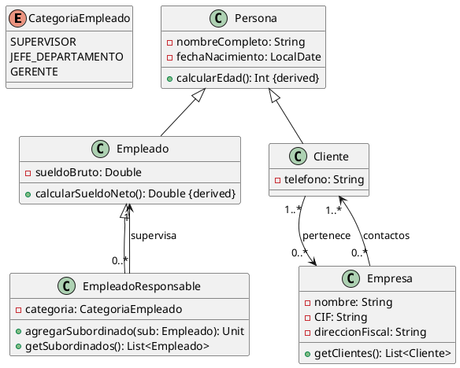

# **Solución: Ejercicio 4 - Sistema de Gestión Empresarial**

## Objetivo

Modelar un sistema empresarial con empleados, clientes y empresas, incluyendo jerarquías, relaciones comerciales y cálculos derivados (edad y sueldo neto).

---

# 1. Identificación de clases

A partir de las reuniones:

### Clases principales:

* **Persona** (clase base para atributos comunes)
* **Empleado**
* **EmpleadoResponsable** (subclase de Empleado)
* **Cliente**
* **Empresa**

---

# 2. Atributos y métodos

## **Clase Persona**

### Atributos privados

* `-nombreCompleto: String`
* `-fechaNacimiento: LocalDate`

### Métodos públicos

* `+calcularEdad(): Int`  *(campo derivado a partir de fechaNacimiento)*

---

## **Clase Empleado** (hereda de Persona)

### Atributos privados

* `-sueldoBruto: Double`

### Métodos públicos

* `+calcularSueldoNeto(): Double`  *(aplica retención estándar)*

---

## **Clase EmpleadoResponsable** (hereda de Empleado)

### Atributos privados

* `-categoria: CategoriaEmpleado` *(enum: SUPERVISOR, JEFE_DEPARTAMENTO, GERENTE)*

### Métodos públicos

* `+agregarSubordinado(sub: Empleado): Unit`
* `+getSubordinados(): List<Empleado>`

### Relaciones reflexivas

* Un **EmpleadoResponsable** puede tener **0..*** subordinados de tipo Empleado
* Un subordinado **1** reporta a un responsable

---

## **Clase Cliente** (hereda de Persona)

### Atributos privados

* `-telefono: String`

### Métodos públicos

* Ninguno obligatorio (entidad de datos)

---

## **Clase Empresa**

### Atributos privados

* `-nombre: String`
* `-CIF: String`
* `-direccionFiscal: String`

### Métodos públicos

* `+getClientes(): List<Cliente>`

### Relaciones

* Una **Empresa** puede tener **0..*** clientes
* Un **Cliente** pertenece a **1..*** empresas *(restricción: todos los clientes deben pertenecer al menos a una empresa)*

---

# 3. Relaciones UML

### Herencia

* Persona → Empleado
* Persona → Cliente
* Empleado → EmpleadoResponsable

### Asociaciones

* EmpleadoResponsable "0..*" → "1" Empleado (subordinados) [reflexiva]
* Empresa "1..*" → "0..*" Cliente
* Cliente "1..*" → "0..*" Empresa

### Notas adicionales

* Edad de persona y sueldo neto son campos derivados `{derived}`.
* Categoría de empleado se modela como enumeración.

---

# 4. Diagrama UML en PlantUML



---

# 5. Código Kotlin

```kotlin
import java.time.LocalDate
import java.time.Period

open class Persona(
    private var nombreCompleto: String,
    private var fechaNacimiento: LocalDate
) {
    fun calcularEdad(): Int {
        return Period.between(fechaNacimiento, LocalDate.now()).years
    }
}

open class Empleado(
    nombreCompleto: String,
    fechaNacimiento: LocalDate,
    private var sueldoBruto: Double
) : Persona(nombreCompleto, fechaNacimiento) {

    open fun calcularSueldoNeto(): Double {
        return sueldoBruto * 0.78 // Retención estándar 22%
    }
}

class EmpleadoResponsable(
    nombreCompleto: String,
    fechaNacimiento: LocalDate,
    sueldoBruto: Double,
    private var categoria: CategoriaEmpleado
) : Empleado(nombreCompleto, fechaNacimiento, sueldoBruto) {

    private val subordinados = mutableListOf<Empleado>()

    fun agregarSubordinado(sub: Empleado) {
        subordinados.add(sub)
    }

    fun getSubordinados(): List<Empleado> {
        return subordinados
    }
}

class Cliente(
    nombreCompleto: String,
    fechaNacimiento: LocalDate,
    private var telefono: String
) : Persona(nombreCompleto, fechaNacimiento)

class Empresa(
    private var nombre: String,
    private var CIF: String,
    private var direccionFiscal: String
) {
    private val clientes = mutableListOf<Cliente>()

    fun agregarCliente(cliente: Cliente) {
        clientes.add(cliente)
    }

    fun getClientes(): List<Cliente> {
        return clientes
    }
}

enum class CategoriaEmpleado {
    SUPERVISOR,
    JEFE_DEPARTAMENTO,
    GERENTE
}
```