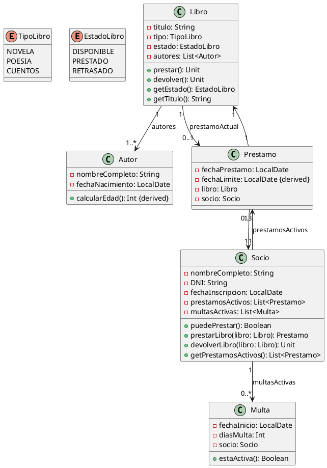

# **Solución: Ejercicio 6 - Sistema de Biblioteca**

## Objetivo

Modelar un sistema de biblioteca con libros, autores, socios, préstamos y multas, incluyendo tipos y estados de libros, límites de préstamos y cálculo de fechas derivadas.

---

# 1. Identificación de clases

### Clases principales:

* **Autor**
* **Libro**
* **Socio**
* **Prestamo** (clase de asociación entre Socio y Libro)
* **Multa**

### Enumeraciones:

* **TipoLibro** (NOVELA, POESIA, CUENTOS)
* **EstadoLibro** (DISPONIBLE, PRESTADO, RETRASADO)

---

# 2. Atributos y métodos

## **Clase Autor**

### Atributos privados

* `-nombreCompleto: String`
* `-fechaNacimiento: LocalDate`

### Métodos públicos

* `+calcularEdad(): Int {derived}`

---

## **Clase Libro**

### Atributos privados

* `-titulo: String`
* `-tipo: TipoLibro`
* `-estado: EstadoLibro`
* `-autores: List<Autor>` *(un libro puede tener uno o más autores)*

### Métodos públicos

* `+prestar(): Unit`
* `+devolver(): Unit`
* `+getEstado(): EstadoLibro`
* `+getTitulo(): String`

---

## **Clase Socio**

### Atributos privados

* `-nombreCompleto: String`
* `-DNI: String`
* `-fechaInscripcion: LocalDate`
* `-prestamosActivos: List<Prestamo>`
* `-multasActivas: List<Multa>`

### Métodos públicos

* `+puedePrestar(): Boolean` *(verifica límite de 3 libros y multas activas)*
* `+prestarLibro(libro: Libro): Prestamo`
* `+devolverLibro(libro: Libro): Unit`
* `+getPrestamosActivos(): List<Prestamo>`

---

## **Clase Prestamo** (clase de asociación)

### Atributos privados

* `-fechaPrestamo: LocalDate`
* `-fechaLimite: LocalDate {derived}` *(fechaPrestamo + 30 días)*
* `-libro: Libro`
* `-socio: Socio`

### Métodos públicos

* Ninguno obligatorio (es una entidad de datos)

---

## **Clase Multa**

### Atributos privados

* `-fechaInicio: LocalDate`
* `-diasMulta: Int` *(3 días × retraso)*
* `-socio: Socio`

### Métodos públicos

* `+estaActiva(): Boolean`

---

# 3. Relaciones UML

### Libro — Autor

* Un **Libro** tiene **1..*** autores
* Un **Autor** puede tener **0..*** libros
* Rol desde Libro: *autores*

### Socio — Prestamo — Libro

* Socio "1" → "0..3" Prestamo
* Libro "1" → "0..1" Prestamo activo
* Rol desde Socio: *prestamosActivos*
* Rol desde Libro: *prestamoActual*

### Socio — Multa

* Socio "1" → "0..*" Multa
* Rol desde Socio: *multasActivas*

---

# 4. Diagrama UML en PlantUML



---

# 5. Código Kotlin

```kotlin
import java.time.LocalDate
import java.time.Period

enum class TipoLibro { NOVELA, POESIA, CUENTOS }
enum class EstadoLibro { DISPONIBLE, PRESTADO, RETRASADO }

class Autor(
    private val nombreCompleto: String,
    private val fechaNacimiento: LocalDate
) {
    fun calcularEdad(): 
}

class Libro(
    private val titulo: String,
    private val tipo: TipoLibro,
    private val autores: List<Autor>
) {
    var estado: EstadoLibro = EstadoLibro.DISPONIBLE
        private set

    fun prestar() {
    }

    fun devolver() {
    }

    fun getEstado(): 
    fun getTitulo(): 
}

class Prestamo(
    val socio: Socio,
    val libro: Libro,
    val fechaPrestamo: LocalDate
) {
    val fechaLimite: LocalDate = fechaPrestamo.plusDays(30)
}

class Multa(
    val socio: Socio,
    val fechaInicio: LocalDate,
    val diasMulta: Int
) {
    fun estaActiva(): 
}

class Socio(
    private val nombreCompleto: String,
    private val DNI: String,
    private val fechaInscripcion: LocalDate
) {
    private val prestamosActivos = mutableListOf<Prestamo>()
    private val multasActivas = mutableListOf<Multa>()

    fun puedePrestar(): 

    fun prestarLibro(libro: Libro):

    fun devolverLibro(libro: Libro) {}
    }

    fun getPrestamosActivos(): 
    fun getMultasActivas(): 
}
```