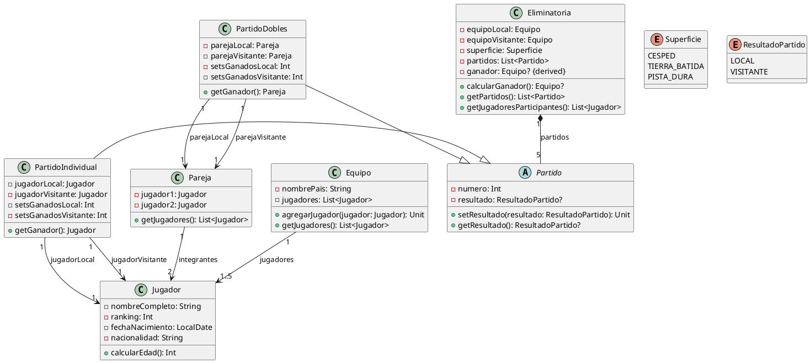

# **Solución: Ejercicio 7 - Copa Davis de Tenis**

## Objetivo

Modelar un sistema de gestión de la Copa Davis, incluyendo equipos, jugadores, eliminatorias, partidos individuales y dobles, superficies y resultados.

---

# 1. Identificación de clases

### Clases principales:

* **Equipo**
* **Jugador**
* **Eliminatoria**
* **Partido** (abstracta)
* **PartidoIndividual** (hereda de Partido)
* **PartidoDobles** (hereda de Partido)
* **Pareja** (para dobles)

### Enumeraciones:

* **Superficie** (CESPED, TIERRA_BATIDA, PISTA_DURA)
* **ResultadoPartido** (LOCAL, VISITANTE)

---

# 2. Atributos y métodos

## **Clase Equipo**

### Atributos privados

* `-nombrePais: String`
* `-jugadores: List<Jugador>` *(max 5 por eliminatoria)*

### Métodos públicos

* `+agregarJugador(jugador: Jugador): Unit`
* `+getJugadores(): List<Jugador>`

---

## **Clase Jugador**

### Atributos privados

* `-nombreCompleto: String`
* `-ranking: Int`
* `-fechaNacimiento: LocalDate`
* `-nacionalidad: String`

### Métodos públicos

* `+calcularEdad(): Int`

---

## **Clase Eliminatoria**

### Atributos privados

* `-equipoLocal: Equipo`
* `-equipoVisitante: Equipo`
* `-superficie: Superficie`
* `-partidos: List<Partido>` *(exactamente 5)*
* `-ganador: Equipo? {derived}`

### Métodos públicos

* `+calcularGanador(): Equipo?`
* `+getPartidos(): List<Partido>`
* `+getJugadoresParticipantes(): List<Jugador>`

---

## **Clase abstracta Partido**

### Atributos privados

* `-numero: Int` *(1 a 5)*
* `-resultado: ResultadoPartido?`

### Métodos públicos

* `+setResultado(resultado: ResultadoPartido): Unit`
* `+getResultado(): ResultadoPartido?`

---

## **Clase PartidoIndividual (hereda Partido)**

### Atributos privados

* `-jugadorLocal: Jugador`
* `-jugadorVisitante: Jugador`
* `-setsGanadosLocal: Int`
* `-setsGanadosVisitante: Int`

### Métodos públicos

* `+getGanador(): Jugador`

---

## **Clase PartidoDobles (hereda Partido)**

### Atributos privados

* `-parejaLocal: Pareja`
* `-parejaVisitante: Pareja`
* `-setsGanadosLocal: Int`
* `-setsGanadosVisitante: Int`

### Métodos públicos

* `+getGanador(): Pareja`

---

## **Clase Pareja**

### Atributos privados

* `-jugador1: Jugador`
* `-jugador2: Jugador`

### Métodos públicos

* `+getJugadores(): List<Jugador>`

---

# 3. Relaciones UML

### Equipo — Jugador

* Equipo "1" → "1..5" Jugador *(por eliminatoria)*
* Jugador "0..*" → Equipo *(puede cambiar de equipo año a año)*

### Eliminatoria — Partido (composición)

* Eliminatoria "1" → "5" Partido
* Rol desde Eliminatoria: *partidos*

### PartidoIndividual / PartidoDobles — Jugador / Pareja

* PartidoIndividual "1" → "1" Jugador local
* PartidoIndividual "1" → "1" Jugador visitante
* PartidoDobles "1" → "1" Pareja local
* PartidoDobles "1" → "1" Pareja visitante

---

# 4. Diagrama UML en PlantUML



---

# 5. Código Kotlin

```kotlin
enum class Superficie { CESPED, TIERRA_BATIDA, PISTA_DURA }
enum class ResultadoPartido { LOCAL, VISITANTE }

class Jugador(
    val nombreCompleto: String,
    val ranking: Int,
    val fechaNacimiento: LocalDate,
    val nacionalidad: String
) {
    fun calcularEdad(): 
}

class Equipo(val nombrePais: String) {
    private val jugadores = mutableListOf<Jugador>()

    fun agregarJugador(jugador: Jugador) {
        if (jugadores.size >= 5) throw Exception("Máximo 5 jugadores por equipo")
        jugadores.add(jugador)
    }

    fun getJugadores():
}

class Pareja(val jugador1: Jugador, val jugador2: Jugador) {
    fun getJugadores():
}

abstract class Partido(val numero: Int) {
    var resultado: ResultadoPartido? = null
        private set

    fun setResultado(resultado: ResultadoPartido) {}

    fun getResultado():
}

class PartidoIndividual(
    numero: Int,
    val jugadorLocal: Jugador,
    val jugadorVisitante: Jugador,
    var setsGanadosLocal: Int = 0,
    var setsGanadosVisitante: Int = 0
) : Partido(numero) {
    fun getGanador():
}

class PartidoDobles(
    numero: Int,
    val parejaLocal: Pareja,
    val parejaVisitante: Pareja,
    var setsGanadosLocal: Int = 0,
    var setsGanadosVisitante: Int = 0
) : Partido(numero) {
    fun getGanador():
}

class Eliminatoria(
    val equipoLocal: Equipo,
    val equipoVisitante: Equipo,
    val superficie: Superficie
) {
    private val partidos = mutableListOf<Partido>()

    val ganador: Equipo?
        get() = calcularGanador()

    fun agregarPartido(partido: Partido) {}

    fun getPartidos(): 

    fun calcularGanador():{}

    fun getJugadoresParticipantes():  {}
}
```