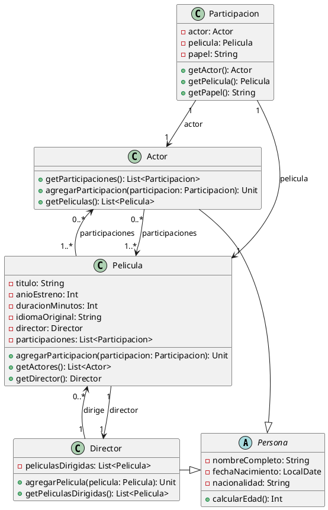

# **Solución: Ejercicio 9 - Sistema de Gestión de Películas**

## Objetivo

Modelar un sistema de gestión de catálogo de películas con información de películas, actores, directores y la participación de los actores en cada película.

---

# 1. Identificación de clases

### Clases principales:

* **Película**
* **Persona** (abstracta)
* **Actor** (hereda Persona)
* **Director** (hereda Persona)
* **Participacion** (clase de asociación entre Actor y Película)

---

# 2. Atributos y métodos

## **Clase abstracta Persona**

### Atributos privados

* `-nombreCompleto: String`
* `-fechaNacimiento: LocalDate`
* `-nacionalidad: String`

### Métodos públicos

* `+calcularEdad(): Int`

---

## **Clase Actor (hereda Persona)**

### Atributos privados

* Ninguno adicional

### Métodos públicos

* `+getParticipaciones(): List<Participacion>`
* `+agregarParticipacion(participacion: Participacion): Unit`
* `+getPeliculas(): List<Pelicula>`

---

## **Clase Director (hereda Persona)**

### Atributos privados

* `-peliculasDirigidas: List<Pelicula>`

### Métodos públicos

* `+agregarPelicula(pelicula: Pelicula): Unit`
* `+getPeliculasDirigidas(): List<Pelicula>`

---

## **Clase Película**

### Atributos privados

* `-titulo: String`
* `-anioEstreno: Int`
* `-duracionMinutos: Int`
* `-idiomaOriginal: String`
* `-director: Director`
* `-participaciones: List<Participacion>`

### Métodos públicos

* `+agregarParticipacion(participacion: Participacion): Unit`
* `+getActores(): List<Actor>`
* `+getDirector(): Director`

---

## **Clase Participacion (clase de asociación Actor-Película)**

### Atributos privados

* `-actor: Actor`
* `-pelicula: Pelicula`
* `-papel: String`

### Métodos públicos

* `+getActor(): Actor`
* `+getPelicula(): Pelicula`
* `+getPapel(): String`

---

# 3. Relaciones UML

### Director — Película

* Director "1" → "0..*" Película
* Película "1" → "1" Director

### Actor — Película → Participación (N:M)

* Actor "0..*" → "1..*" Película a través de Participacion
* Película "1..*" → "0..*" Actor a través de Participacion

### Navegabilidad

* Película conoce a sus participaciones
* Actor conoce a sus participaciones

---

# 4. Diagrama UML en PlantUML



---

# 5. Código Kotlin

```kotlin
import java.time.LocalDate
import java.time.Period

abstract class Persona(
    val nombreCompleto: String,
    val fechaNacimiento: LocalDate,
    val nacionalidad: String
) {
    fun calcularEdad():
}

class Actor(
    nombreCompleto: String,
    fechaNacimiento: LocalDate,
    nacionalidad: String
) : Persona(nombreCompleto, fechaNacimiento, nacionalidad) {

    private val participaciones = mutableListOf<Participacion>()

    fun agregarParticipacion()

    fun getParticipaciones(): 

    fun getPeliculas():
}

class Director(
    nombreCompleto: String,
    fechaNacimiento: LocalDate,
    nacionalidad: String
) : Persona(nombreCompleto, fechaNacimiento, nacionalidad) {

    private val peliculasDirigidas = mutableListOf<Pelicula>()

    fun agregarPelicula()

    fun getPeliculasDirigidas(): 
}

class Pelicula(
    val titulo: String,
    val anioEstreno: Int,
    val duracionMinutos: Int,
    val idiomaOriginal: String,
    val director: Director
) {
    private val participaciones = mutableListOf<Participacion>()

    fun agregarParticipacion()

    fun getActores(): 

    fun getDirector():
}

class Participacion(
    private val actor: Actor,
    private val pelicula: Pelicula,
    private val papel: String
) {
    fun getActor(): 
    fun getPelicula(): 
    fun getPapel(): 
}
```
